

 

<b>Manual de usuario del CRM Mercadeo</b>

Juan David Céspedes Mendoza

Asistente de software

Fundación La Liga Ama Salvar Vidas

Versión de la aplicación v3.5.0

Octubre de 2026

 

## Tabla de contenido

- [Generalidades](#generalidades)
  - [Antes de empezar](#antes-de-empezar)
  - [Ingresar al CRM](#ingresar-al-crm)
  - [Conocer la pantalla](#conocer-la-pantalla)
  - [Roles y permisos](#roles-y-permisos)
  - [Dashboard](#dashboard)
- [Plan Liga](#plan-liga)
  - [Titulares y beneficiarios](#titulares-y-beneficiarios)
  - [Recordatorios de vencimiento](#recordatorios-de-vencimiento)
  - [Renovaciones por mes](#renovaciones-por-mes)
- [Comercial](#comercial)
  - [Contactos](#contactos)
  - [Empresas](#empresas)
  - [Proveedores](#proveedores)
  - [Oportunidades](#oportunidades)
  - [Embudos](#embudos)
  - [Servicios](#servicios)
- [Marketing](#marketing)
  - [Campañas](#campañas)
  - [Automatizaciones](#automatizaciones)
- [Operaciones](#operaciones)
  - [Bitácora](#bitácora)
  - [Importación](#importación)
- [Cuenta y ayuda](#cuenta-y-ayuda)
  - [Configuración](#configuración)
  - [Preguntas frecuentes](#preguntas-frecuentes)
  - [Glosario](#glosario)

 

<b>Manual de usuario del CRM Mercadeo</b>

# Generalidades

## Antes de empezar

El CRM Mercadeo reúne en un solo lugar la información de las personas y organizaciones con las que trabaja la Fundación: los **titulares y beneficiarios** del programa Plan Liga, los **contactos** y **empresas** del área comercial, los **proveedores**, las **oportunidades** de venta y la **bitácora** donde queda cada llamada, correo o reunión.

Este manual sigue el orden del menú lateral. No necesita leerlo completo: busque en el índice el módulo con el que trabaja.

**Cómo leer este manual.** Los nombres de botones y campos aparecen así: **Nuevo titular**. Las rutas del menú aparecen así: *Plan Liga › Titulares y Beneficiarios*. Los campos marcados con **\*** en los formularios son obligatorios.

**Lo que usted ve depende de su rol.** Si en este manual se menciona un botón que no aparece en su pantalla, lo más probable es que su rol no tenga ese permiso. Consulte [Roles y permisos](#roles-y-permisos).

## Ingresar al CRM

1. Abra la dirección del CRM en su navegador (Chrome, Edge o Firefox actualizados).
2. En **Usuario** escriba su usuario institucional (por ejemplo, **ejemplo**) y en **Contraseña** la clave entregada por TI.
3. Pulse **Acceder**. Si los datos son correctos, entrará al [Dashboard](#dashboard).

**Figura 1**

*Pantalla de inicio de sesión*

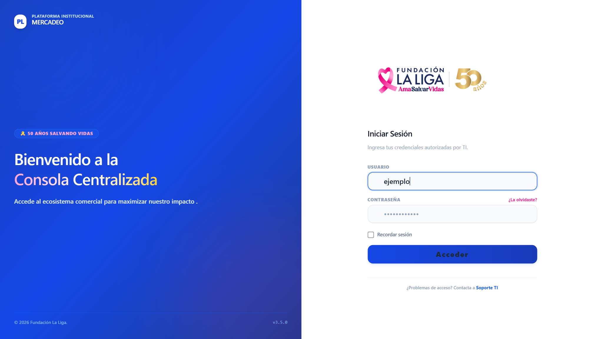

*Nota.* Captura del CRM Mercadeo con datos ficticios de demostración.

#### Si aparece el mensaje «Sin rol en el CRM»

Su usuario existe, pero todavía no tiene un rol asignado dentro del CRM. Pulse **Cerrar sesión** y pida al administrador del sistema que le asigne un rol (ver [Configuración](#configuración)). Cuando se lo asignen, vuelva a ingresar.

#### Si el sistema lo saca de la sesión de repente

Cada vez que usted cambia de pantalla, el CRM verifica su rol. Si un administrador se lo cambió o se lo retiró, la sesión se cierra y debe volver a ingresar para trabajar con los permisos nuevos. No es un error.

**¿Olvidó la contraseña o no puede entrar?** Comuníquese con el área de TI.

## Conocer la pantalla

Todas las pantallas del CRM comparten la misma estructura, formada por estas seis partes:

1. **Ruta actual**, en la barra superior izquierda. Indica en qué módulo está.
2. **Menú lateral**, a la izquierda, organizado en grupos: Plan Liga, Comercial, Marketing y Operaciones. Puede contraerse para ganar espacio; en celular se abre con el botón de menú.
3. **Pestañas**, debajo de la barra superior. Cada módulo que abre queda como pestaña, con un máximo de 4. Al abrir un quinto módulo, este reemplaza la pestaña en la que estaba. Puede arrastrar las pestañas para reordenarlas.
4. Botón **Actualizar**, en la barra superior derecha. Vuelve a cargar los datos del módulo actual sin recargar toda la página.
5. Botón de **modo claro y modo oscuro**, junto al anterior.
6. **Menú de usuario**, en la esquina superior derecha, con su nombre y rol. Desde ahí entra a **Configuración** o pulsa **Cerrar sesión**.

### Elementos comunes en los módulos

- **Buscador:** filtra la tabla mientras escribe (por nombre, documento, empresa, correo, según el módulo).
- **Filtros desplegables:** estado, ciudad, responsable, edad, etc. Cuando hay filtros activos aparece **Limpiar (n)** para quitarlos todos.
- **Paginación:** al pie de la tabla, con las flechas de página anterior y siguiente.
- **Exportar:** descarga a Excel lo que está viendo.
- **Seguimiento** (icono de portapapeles): registra rápidamente una llamada, correo, reunión, WhatsApp, mensaje o nota. Todo seguimiento queda guardado en la [Bitácora](#bitácora).

## Roles y permisos

Cada usuario tiene **un rol** dentro del CRM, y cada rol habilita permisos por módulo. El menú lateral solo muestra los módulos que su rol puede ver.

| Permiso                             | Qué le permite hacer                                                               |
| ----------------------------------- | ----------------------------------------------------------------------------------- |
| Ver                                 | Ver el módulo en el menú, consultar, buscar, filtrar y exportar.                  |
| Gestionar                           | Crear, editar, activar, registrar seguimientos e importar.                          |
| Eliminar                            | Borrar registros (contactos, empresas, proveedores, actividades, automatizaciones). |
| Desactivar (Plan Liga)              | Desactivar titulares y beneficiarios.                                               |
| Editar fecha de ingreso (Plan Liga) | Cambiar la fecha de inscripción de un titular o de un grupo completo.              |
| Elegir plan (Plan Liga)             | Asignar un plan distinto al Estándar. Normalmente lo tiene el rol Comercial.       |
| Configuración                      | Asignar y retirar roles a otros usuarios.                                           |

Hay dos perfiles especiales: **Administrador**, que tiene todos los permisos, y **Jefe**, que tiene todos excepto los de configuración. Estos dos se asignan por fuera del CRM, a través de TI.

## Dashboard

Es la pantalla de inicio. Resume el estado general de la operación. Arriba a la derecha elija el **periodo**: últimos 7 días, últimos 30 días, este trimestre, este año o todo.

- **Indicadores:** total de contactos, titulares activos de Plan Liga, oportunidades en curso, servicios Plan Liga activos y seguimientos pendientes.
- **Actividad reciente:** las últimas interacciones registradas en la Bitácora.
- **Distribución de contactos:** clientes activos, prospectos activos e inactivos.
- **Top de planes:** los planes con más afiliados.
- **Resumen del embudo:** cuántas oportunidades hay en cada etapa.
- **Accesos rápidos** a los módulos más usados.
- Al final, el **tablero de Tableau** con los reportes institucionales.

**Figura 2**

*Dashboard con indicadores y actividad reciente*

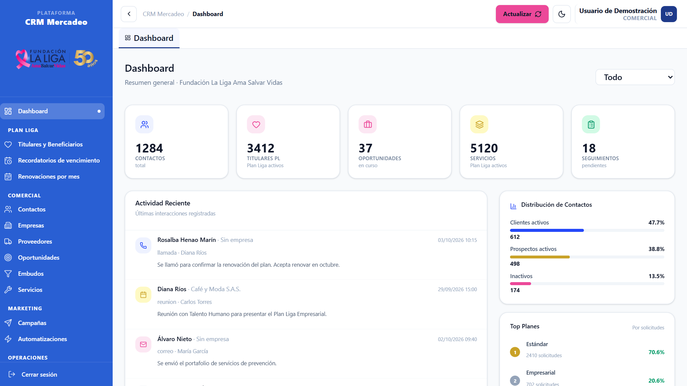

*Nota.* Captura del CRM Mercadeo con datos ficticios de demostración.

# Plan Liga

## Titulares y beneficiarios

Ruta en el menú: *Plan Liga › Titulares y Beneficiarios*.

Aquí se administran las afiliaciones al programa Plan Liga. Un **titular** es la persona que contrata el plan; los **beneficiarios** son las personas que el titular incluye dentro de su cupo.

En la parte superior verá el número de **titulares activos** y **beneficiarios activos**. Puede buscar por cédula, nombre, empresa o correo, y filtrar por estado, plan, sexo biológico y rango de edad.

### Columnas de la tabla

**Titular** (nombre, correo, teléfono), **Documento**, **Empresa**, **Plan Contratado** (Estándar u otro plan), **Tipo de Plan**, **Beneficiarios** (cupos usados / cupo total, con puntos), **Inscripción**, **Estado** y **Acciones**.

**Figura 3**

*Listado de titulares de Plan Liga*

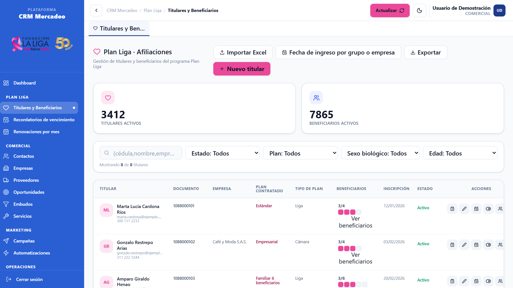

*Nota.* Captura del CRM Mercadeo con datos ficticios de demostración.

#### Iconos de la columna Acciones

- **Portapapeles:** registrar seguimiento.
- **Lápiz:** editar datos del titular.
- **Calendario:** editar fecha de inscripción.
- **Interruptor:** activar o desactivar.
- **Personas:** ver beneficiarios.
- **Flechas circulares:** reemplazar titular.

### Crear un titular

1. Pulse **Nuevo titular**.
2. Escriba el **nombre completo** en cuatro casillas (primer y segundo nombre, primer y segundo apellido). Se exige al menos un nombre y un apellido.
3. Complete los obligatorios: **tipo de documento, documento, fecha de nacimiento, sexo biológico, departamento, ciudad, plan contratado, tipo de plan, EPS y fecha de inscripción**. Correo, teléfono, dirección, empresa y factura son opcionales.
4. En **Plan contratado** elija el plan. Si su rol no tiene el permiso «Elegir plan», el campo queda fijo en **Estándar**.
5. Si el titular tiene plan complementario de salud, marque **Sí** y escriba el plan y su nombre comercial.
6. Deje marcada la casilla **Enviar correo de registro a este titular** si quiere que reciba el correo de registro.
7. Pulse **Crear titular**.

**Datos que el sistema fija.** El titular siempre se crea como **Activo** y como tipo de afiliado **1 (cotizante)**. El estado solo se cambia con el interruptor de la tabla.

### Activar, desactivar y renovar un titular

Pulse el interruptor de la fila.

- **Desactivar:** confirme con **Desactivar**. Requiere el permiso de desactivar.
- **Activar (o renovar):** el sistema pide la **fecha de ingreso**. Puede marcar **Aplicar esta fecha también a los beneficiarios de este titular**. Con el permiso «Elegir plan» también puede marcar **Cambiar el plan al renovar** y escoger el plan nuevo.

### Editar la fecha de inscripción

Con el icono de calendario se cambia la fecha de inscripción de un titular. Si el titular está inactivo, al guardar la fecha **también queda activado**.

### Cambiar la fecha de ingreso de un grupo o empresa

1. Pulse **Fecha de ingreso por grupo o empresa**.
2. Busque la empresa, grupo o tipo de plan y elija la nueva fecha.
3. Pulse **Aplicar cambio**. El sistema le muestra cuántos titulares y beneficiarios activos se van a modificar.
4. Si los números son correctos, pulse **Aceptar**.

### Gestionar los beneficiarios de un titular

Pulse **Ver beneficiarios** (o el icono de personas). Se abre un panel lateral con:

- Pestañas **Activos** e **Inactivos**.
- La barra de **cupos utilizados** (por ejemplo, 3 / 4 activos). El plan Estándar tiene un cupo de 4 beneficiarios; otros planes pueden tener más o, como los planes individuales, ninguno.
- Por cada beneficiario, los botones **Seguimiento**, **Editar**, **Activar** / **Desactivar**, **Reemplazar** y **Cambiar titular**.

**Figura 4**

*Panel de beneficiarios de un titular*

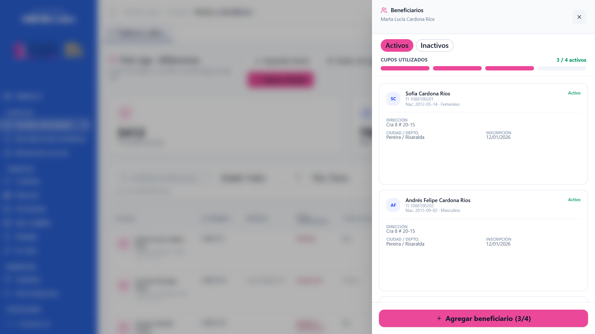

*Nota.* Captura del CRM Mercadeo con datos ficticios de demostración.

#### Agregar un beneficiario

1. En el panel pulse **Agregar beneficiario (n/m)**. Si el botón dice **Límite alcanzado**, el titular ya llenó su cupo.
2. Complete nombre, tipo y número de documento, fecha de nacimiento, departamento y ciudad (obligatorios), más los datos opcionales de contacto, EPS y plan de salud.
3. La fecha de inscripción se hereda del titular; no se escribe.
4. Marque **Enviar correo de bienvenida a este beneficiario** si corresponde y pulse **Agregar beneficiario**.

#### Mover un beneficiario a otro titular

Pulse **Cambiar titular**, escriba el documento del nuevo titular, pulse **Continuar** y confirme con **Sí, cambiar titular**. El beneficiario conserva su plan e historial. **No se puede deshacer.**

### Reemplazar a un titular o beneficiario

**Atención: esto no es una edición.** Reemplazar **da de baja** a la persona actual y **da de alta** a una persona nueva en su lugar, que hereda el plan, el cupo y el orden. También hace las altas y bajas correspondientes en Servinte (ABPAC/INCLE). No se puede deshacer. Si solo necesita corregir un dato (un nombre mal escrito, un teléfono), use **Editar**.

1. Pulse el icono de flechas circulares (titular) o **Reemplazar** (beneficiario). Solo aparece en registros activos.
2. Complete los datos de la persona nueva: nombre, tipo y número de documento son obligatorios.
3. Marque la casilla que confirma que entiende el efecto del reemplazo.
4. Pulse **Confirmar reemplazo**.

### Importar desde Excel

El botón **Importar Excel** ofrece tres operaciones:

| Operación                        | Para qué sirve                                                                                                                           |
| --------------------------------- | ----------------------------------------------------------------------------------------------------------------------------------------- |
| Agregar grupos                    | Crea titulares y sus beneficiarios en bloque. Primero elija el**plan del archivo** (solo Estándar si no tiene permiso para elegir plan). |
| Activar / Desactivar titular      | Cambia el estado de titulares existentes, identificados por documento.                                                                    |
| Activar / Desactivar beneficiario | Igual, para beneficiarios.                                                                                                                |

1. Elija la operación y pulse **Descargar** para obtener la plantilla correcta.
2. Llene la plantilla. En «Agregar grupos», cada titular ocupa una fila y sus beneficiarios van en las filas justo debajo. Si usa menos filas que el cupo, deje al menos una fila vacía antes del siguiente titular.
3. Para activar o desactivar, elija la acción.
4. Arrastre el archivo (.xlsx, .xls o .csv, máximo 5 MB) y pulse **Procesar archivo**.
5. Revise el resultado: total de afiliados, procesados y con errores, con el detalle de cada error.

**Si el archivo tiene errores de formato,** el sistema no ejecuta **ninguna** acción y muestra «No se ejecutó ninguna acción». Corrija el archivo y vuelva a subirlo.

### Exportar

**Exportar** genera un Excel con los titulares según los filtros aplicados. Puede tardar unos segundos.

## Recordatorios de vencimiento

Ruta en el menú: *Plan Liga › Recordatorios de vencimiento*.

Muestra los titulares cuya membresía está próxima a vencer y permite enviarles un correo de recordatorio. Al entrar, elija el segmento:

- **Particular:** titulares individuales sin empresa. Desde aquí **se envía el correo** a cada titular. Se excluyen el plan LIGA (empleados) y los titulares de empresa.
- **Empresa:** titulares de convenios Plan Liga Empresarial, agrupados por empresa. Es **solo de consulta**: no se envían correos.

### Ajustar la ventana de días

Defina **Días antes de vencer** (0 a 60) y **Días ya vencido** (0 a 30) y pulse **Aplicar**. Con «Días ya vencido» en 0, quienes ya vencieron dejan de aparecer al día siguiente.

### Enviar recordatorios (Particular)

1. Revise los indicadores: **nuevos por enviar**, **último envío** (fecha y quién lo hizo) y el **resultado de la última corrida**.
2. En la tabla «Próximos a vencer», la columna **Aviso** dice **Ya enviado** o **Pendiente**.
3. Pulse **Enviar nuevos (n)** para enviar solo a quienes aún no han recibido el correo. Confirme en el cuadro de diálogo.
4. Al terminar verá cuántos se enviaron y cuáles fallaron, con el correo de cada fallo.

**Figura 5**

*Recordatorios de vencimiento, segmento Particular*

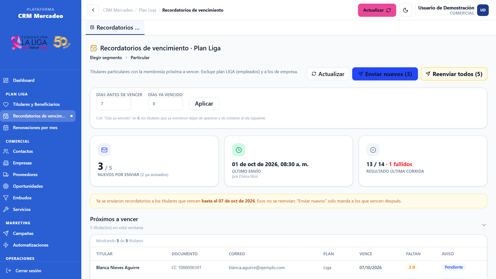

*Nota.* Captura del CRM Mercadeo con datos ficticios de demostración.

**Reenviar todos.** El botón **Reenviar todos (n)** vuelve a mandar el correo a toda la ventana, incluidos quienes ya lo recibieron. Esas personas recibirán el correo dos veces. Úselo solo cuando sea necesario.

La sección **Historial de envíos** muestra cada corrida: fecha, quién la ejecutó, ventana usada, enviados, fallidos y total. Pulse una fila con fallos para ver los correos que no se pudieron entregar.

### Consultar por empresa

En **Empresa** verá cuántas empresas y colaboradores tienen vencimientos, y por cada empresa la fecha de vencimiento más próxima. Pulse **Ver detalle** para ver la lista de colaboradores. Use las migas de pan de la parte superior para volver.

## Renovaciones por mes

Ruta en el menú: *Plan Liga › Renovaciones por mes*.

Lista los titulares que se activaron o renovaron en un mes, según su fecha de ingreso. Cambie de mes con las flechas junto al nombre del mes.

Las cuatro tarjetas superiores también funcionan como filtro de la tabla. Pulse una para ver solo ese grupo:

- **Total del mes:** todos los titulares con fecha de ingreso en ese mes.
- **Renovaciones:** ya eran titulares y volvieron a activar el plan.
- **Altas nuevas:** se registraron en Plan Liga por primera vez.
- **Vencen en el mes:** titulares activos cuyo plan cumple un año ese mes.

**Figura 6**

*Renovaciones por mes con filas marcadas por color*

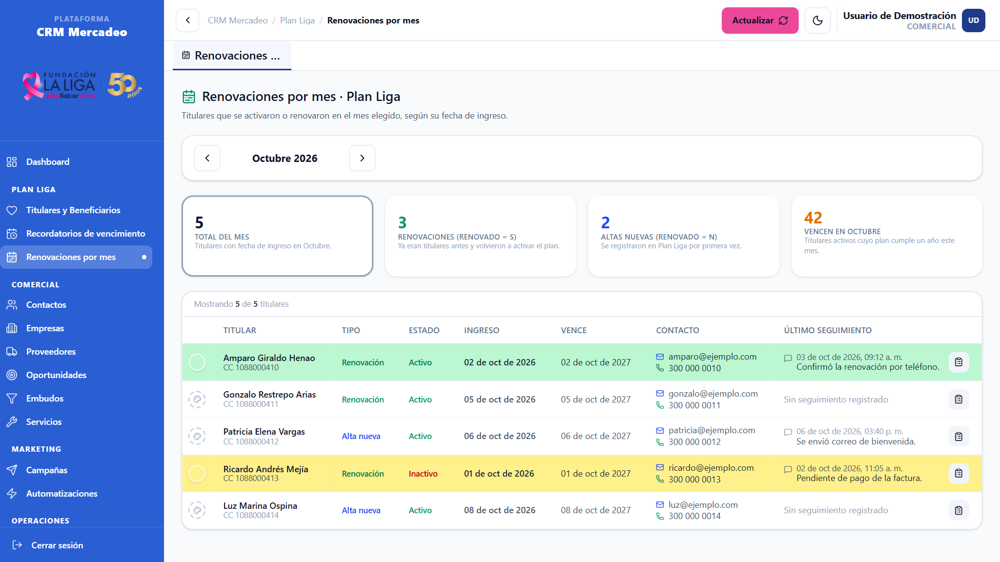

*Nota.* Captura del CRM Mercadeo con datos ficticios de demostración.

La tabla muestra tipo (renovación o alta nueva), estado, fechas de ingreso y vencimiento, contacto y el **último seguimiento** registrado.

#### Marcar filas con color

Pulse el icono de paleta al inicio de la fila y elija un color (amarillo, verde, rojo, azul, morado o naranja) para organizar su gestión, por ejemplo «ya llamado» o «pendiente de pago». El color queda guardado para todo el equipo. Use **Quitar color** para borrarlo.

El icono de portapapeles al final de la fila registra un seguimiento.

# Comercial

## Contactos

Ruta en el menú: *Comercial › Contactos*.

Personas con las que el área comercial tiene relación. Cada contacto tiene un **tipo** (Cliente o Prospecto) y un **estado** (Activo o Inactivo).

Filtros disponibles: estado, tipo de contacto, ciudad, departamento, responsable, sexo y edad.

**Figura 7**

*Gestión de contactos*

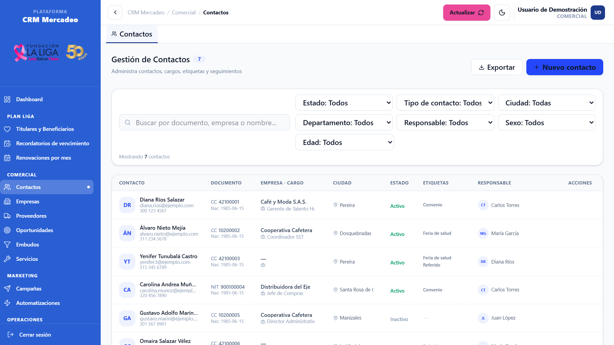

*Nota.* Captura del CRM Mercadeo con datos ficticios de demostración.

### Crear un contacto

1. Pulse **Nuevo contacto**.
2. Escriba el nombre completo y elija **departamento** y **ciudad** (obligatorios).
3. Complete lo que tenga: documento, correo, teléfono, empresa asociada, cargo, tipo de contacto, fecha de nacimiento y sexo.
4. Asigne **etiquetas** haciendo clic sobre las existentes, o cree una nueva con **Nueva etiqueta** (nombre y color).
5. Pulse **Crear contacto**.

### Acciones por contacto

- **Portapapeles:** registrar seguimiento.
- **Interruptor:** activar o inactivar.
- **Lápiz:** editar.
- **Reloj:** historial de actividades.
- **Papelera:** eliminar (con confirmación).

El **historial** muestra todas las actividades registradas con ese contacto (tipo, fecha, descripción y quién la registró). Desde ahí también puede pulsar **Registrar actividad**.

## Empresas

Ruta en el menú: *Comercial › Empresas*.

Organizaciones vinculadas. La tabla muestra razón social, NIT, industria, ciudad, número de contactos asociados y estado (Activa o Inactiva).

- **Nueva empresa**: razón social, NIT, industria, dirección, ciudad y estado (todos obligatorios).
- **Importar de Plan Liga**: crea automáticamente una empresa por cada nombre de empresa registrado en Plan Liga que aún no exista en este catálogo.
- Iconos por fila: editar, historial y eliminar.

**Figura 8**

*Gestión de empresas*

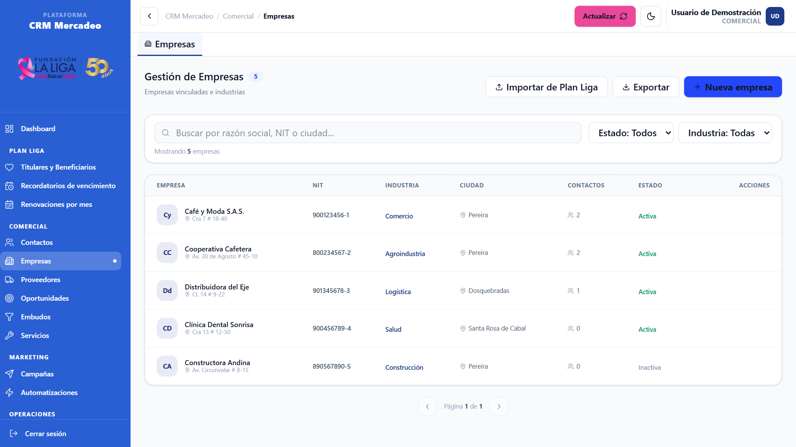

*Nota.* Captura del CRM Mercadeo con datos ficticios de demostración.

## Proveedores

Ruta en el menú: *Comercial › Proveedores*.

Registro de proveedores por categoría (por ejemplo, Insumos Médicos, Material POP, Transporte).

- **Nuevo proveedor**: solo el nombre es obligatorio; también puede registrar categoría, NIT, correo, teléfono y estado.
- El icono de llave inglesa abre las **actividades del proveedor**: servicios prestados con nombre, cantidad, precio y descripción. Se muestran las 4 más recientes; use el buscador para ver las demás. Agregue una con **Nueva actividad**.

**Figura 9**

*Gestión de proveedores*

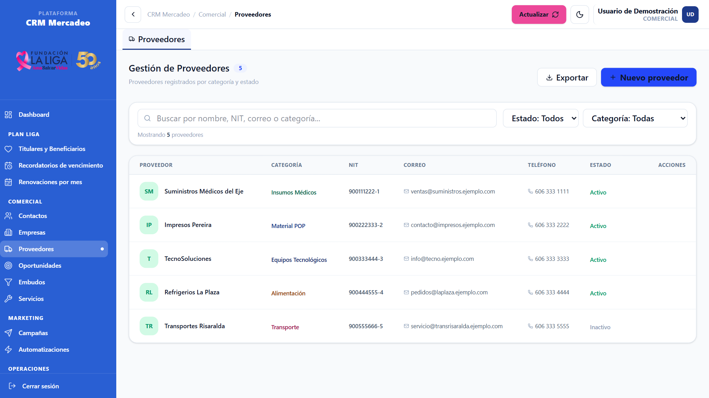

*Nota.* Captura del CRM Mercadeo con datos ficticios de demostración.

## Oportunidades

Ruta en el menú: *Comercial › Oportunidades*.

El pipeline comercial. En el encabezado aparece el valor total de las oportunidades. Cada oportunidad avanza por estas etapas:

**Lead → Primer Contacto → Reunión → Cotización → Negociación → Ganada / Perdida**

El resumen de etapas sobre la tabla muestra cuántas oportunidades hay en cada una; pulse una etapa para filtrar.

**Figura 10**

*Pipeline de oportunidades por etapa*

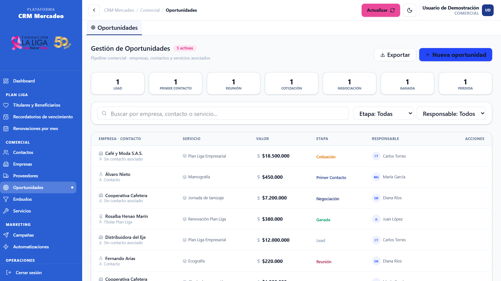

*Nota.* Captura del CRM Mercadeo con datos ficticios de demostración.

### Crear una oportunidad

1. Pulse **Nueva oportunidad**.
2. Elija el **tipo de cliente**: Empresa (y, si quiere, uno de sus contactos), Contacto o Titular Plan Liga. Busque y seleccione el cliente.
3. Elija el **servicio**, escriba el **valor** y ajuste la **probabilidad** de cierre con la barra (0 a 100 %).
4. Elija la etapa y guarde.

En la tabla, el trofeo marca la oportunidad como **Ganada** y el círculo con X la marca como **Perdida**. Una vez cerrada, esos botones desaparecen.

## Embudos

Ruta en el menú: *Comercial › Embudos*.

Herramientas de segmentación para armar grupos de personas y trabajarlos. Tiene dos vistas.

**Figura 11**

*Inicio del módulo Embudos*

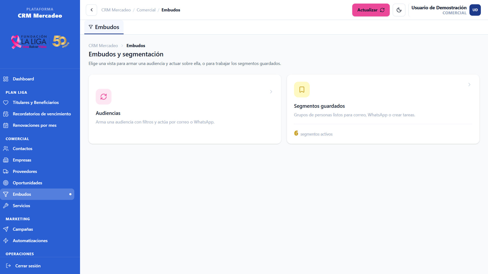

*Nota.* Captura del CRM Mercadeo con datos ficticios de demostración.

### Audiencias

1. Abra el panel **Filtros de segmento** y combine: plan (Plan Liga o no Plan Liga), uso del plan (con uso o sin uso), sexo, rango de edad, departamento, ciudad, concepto, servicio, último uso y tipo de vinculación.
2. Pulse **Aplicar**. La tabla muestra las personas que cumplen los filtros, con su plan, servicios usados, último uso, correo y teléfono.
3. Marque las personas que le interesan. Al pie verá cuántas tienen correo y cuántas tienen celular.
4. Pulse **Guardar segmento**, póngale un nombre y guárdelo.

Cuando el filtro de plan es «Plan Liga» aparece el panel **Uso de Plan Liga**, que compara afiliados activos contra afiliados que han usado servicios. Ahí también puede **buscar por documento** para saber si un titular o beneficiario ha usado el plan.

**Figura 12**

*Audiencias con el panel de uso de Plan Liga y los filtros de segmento*

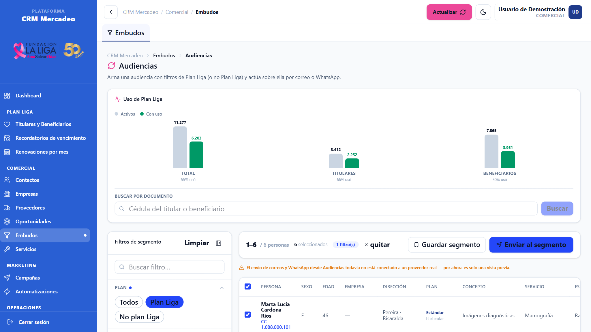

*Nota.* Captura del CRM Mercadeo con datos ficticios de demostración.

### Segmentos guardados

Lista los segmentos con su descripción, criterios, número de personas y cuántas son alcanzables por correo o celular. Puede ordenarlos, filtrarlos por tamaño mínimo y pulsar **Abrir en Audiencias** para refinarlos.

**Figura 13**

*Segmentos guardados*

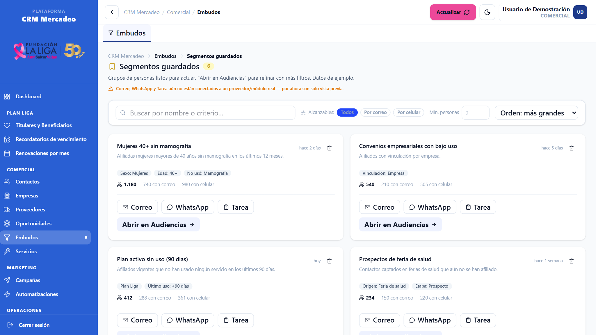

*Nota.* Captura del CRM Mercadeo con datos ficticios de demostración.

**Función en preparación.** Los botones **Enviar al segmento**, **Correo**, **WhatsApp** y **Tarea** todavía no están conectados a un proveedor de envío. Hoy son solo una vista previa: **no se envía nada**. Para enviar correos use [Campañas](#campañas) o [Recordatorios de vencimiento](#recordatorios-de-vencimiento).

## Servicios

Ruta en el menú: *Comercial › Servicios*.

Catálogo de categorías de servicio de Plan Liga y de los planes que contiene cada una. Pulse **Ver más** en una categoría para ver sus planes: nombre, estado, tipo de cliente (Particular o Empresarial), descripción y número de beneficiarios.

- **Agregar servicio** crea una categoría nueva.
- **Agregar plan a «categoría»** crea un plan dentro de esa categoría: nombre, tipo de cliente, estado, número de beneficiarios y descripción.

**Figura 14**

*Categoría de servicio desplegada con sus planes*

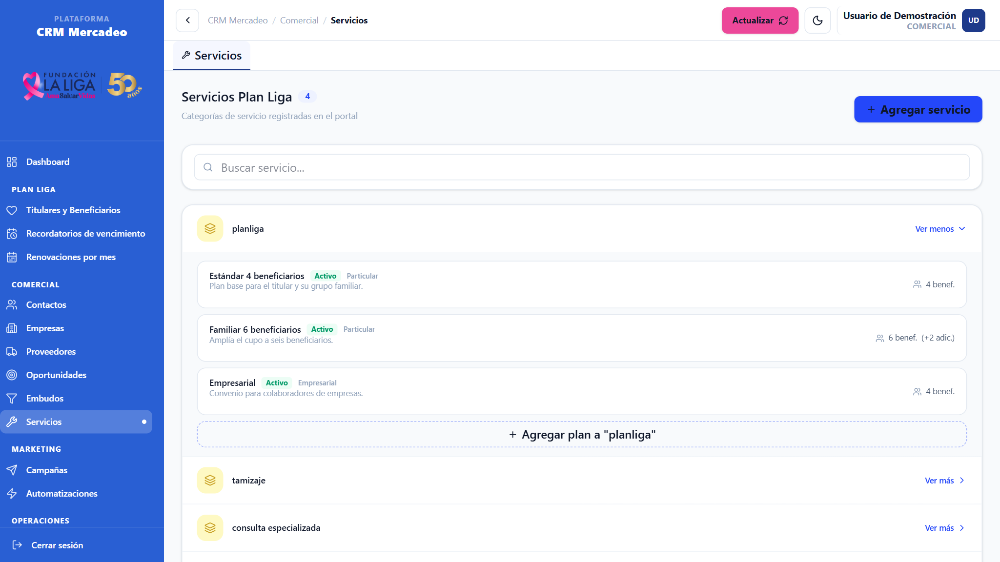

*Nota.* Captura del CRM Mercadeo con datos ficticios de demostración.

**Beneficiarios adicionales.** Se calculan solos: es lo que pasa de 4, el cupo base de un grupo. Un plan con 6 beneficiarios tiene 2 adicionales.

# Marketing

## Campañas

Ruta en el menú: *Marketing › Campañas*.

Diseño y envío de correos con un editor visual de arrastrar y soltar.

**Importante: las plantillas se guardan en su navegador.** Las plantillas quedan almacenadas en el navegador y el equipo donde las creó. No las verá desde otro computador ni otro navegador, y se pierden si borra los datos de navegación. Use **Descargar** para guardar una copia en .html de las plantillas importantes.

### Crear una plantilla

1. Pulse **Nueva plantilla**.
2. Escriba el **nombre** (uso interno, el destinatario no lo ve) y el **asunto** (lo que el destinatario verá en su bandeja).
3. Diseñe el correo arrastrando bloques al lienzo. También puede **Importar** un archivo .html existente.
4. Revise con **Previa** y pulse **Guardar**.

### Enviar una plantilla

1. Pulse el icono de enviar en la plantilla (o **Enviar** dentro del editor).
2. Elija **Una persona** y escriba su correo, o **Grupo de correos** y pegue varios correos separados por coma, espacio o salto de línea. También puede elegir un grupo guardado.
3. Si quiere reutilizar la lista, marque **Guardar esta lista como grupo** y póngale nombre.
4. Revise cuántos destinatarios son válidos (los inválidos se omiten) y pulse **Enviar (n)**.

Cada destinatario recibe un correo individual; nadie ve los correos de los demás. Al final verá a quiénes se envió y cuáles fallaron.

Otras acciones de cada plantilla: editar, duplicar, descargar HTML y eliminar.

**Figura 15**

*Listado de plantillas de correo en Campañas*

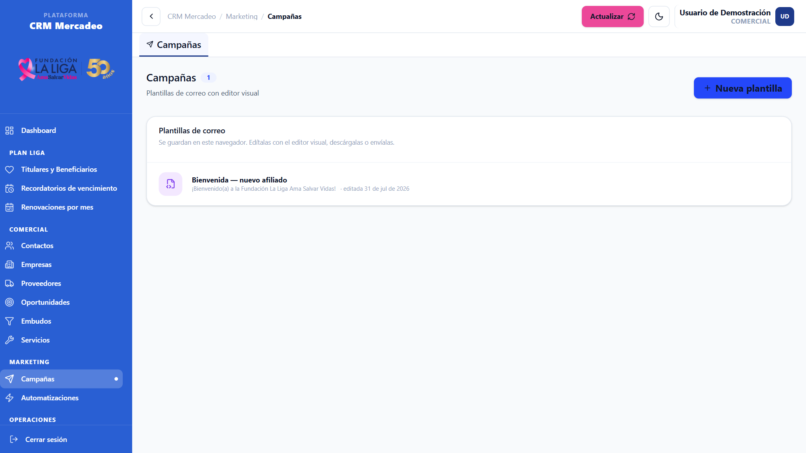

*Nota.* Captura del CRM Mercadeo con datos ficticios de demostración.

## Automatizaciones

Ruta en el menú: *Marketing › Automatizaciones*.

Reglas que ejecutan tareas de forma automática. Arriba verá cuántas están activas, el total de ejecuciones y cuántas tienen errores. Puede filtrar por estado: Activa, Pausada o Error.

### Crear una automatización

1. Pulse **Nueva automatización**.
2. Escriba el nombre y una descripción de lo que hace.
3. En **Acción** elija **Enviar correo** (la acción disponible hoy).
4. Escriba los **correos destino** separados por comas, el **asunto** y el **cuerpo del correo**. Al final del mensaje se agrega solo un aviso de «no responder».
5. Guarde.

En cada tarjeta puede pausar o reanudar, editar y eliminar. Una tarjeta marcada con error indica que la automatización falló y se detuvo: revise su configuración.

**Figura 16**

*Automatizaciones con sus indicadores*

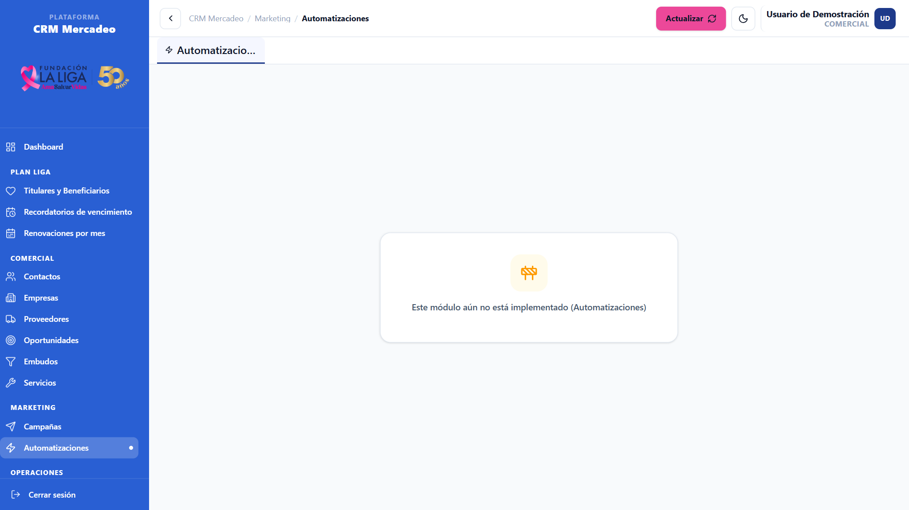

*Nota.* Captura del CRM Mercadeo con datos ficticios de demostración.

# Operaciones

## Bitácora

Ruta en el menú: *Operaciones › Bitácora*.

El historial de todas las interacciones con contactos, empresas y titulares: llamadas, correos, reuniones, WhatsApp, mensajes y notas. Aquí llegan también todos los seguimientos registrados desde otros módulos.

### Registrar una actividad

1. Pulse **Registrar actividad**.
2. Elija el **tipo**: Llamada, Correo, Reunión, WhatsApp, Mensaje o Nota.
3. Asocie al menos un **contacto, empresa o titular Plan Liga**.
4. Describa la **acción realizada** (obligatorio).
5. Si hay algo pendiente, escriba el **próximo paso** y, si quiere, su fecha límite.
6. Opcionalmente, relacione una **oportunidad**. Guarde.

### Pendientes por seguimiento

El recuadro **Pendientes por seguimiento** reúne los próximos pasos que aún no se han hecho, y señala cuántos están vencidos. Pulse el visto bueno de un pendiente para **marcarlo como realizado**, o pulse su texto para abrir la actividad.

### Consultar

Filtre por tipo de actividad (los botones muestran cuántas hay de cada tipo), por usuario o con el buscador (contacto, cédula, empresa o acción). Cada actividad indica quién la registró, cuándo, y si alguien la editó después.

**Figura 17**

*Bitácora de relacionamiento con pendientes por seguimiento*

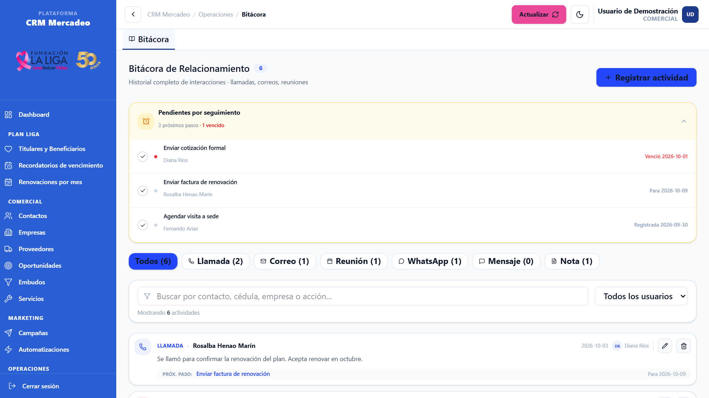

*Nota.* Captura del CRM Mercadeo con datos ficticios de demostración.

## Importación

Ruta en el menú: *Operaciones › Importación*.

Carga masiva de **contactos, empresas o proveedores** desde Excel. Para afiliados de Plan Liga use el botón **Importar Excel** del módulo [Titulares y beneficiarios](#titulares-y-beneficiarios).

1. Elija el tipo: contactos, empresas o proveedores.
2. Pulse **Plantilla de …** para descargar el formato y llénelo sin cambiar los encabezados.
3. Arrastre el archivo (.xlsx o .csv, máximo 10 MB) y pulse **Importar ahora**. Verá el avance registro por registro.
4. Revise el resultado: registros totales, exitosos y con errores.
5. Si hubo errores u observaciones (por ejemplo, una empresa, ciudad o etiqueta que no coincidió), pulse **Reporte** para descargar el detalle fila por fila.

El **historial de importaciones** muestra cada carga con archivo, tipo, usuario, fecha, resultados y estado. Puede filtrarlo por rango de fechas.

**Figura 18**

*Importación masiva e historial de cargas*

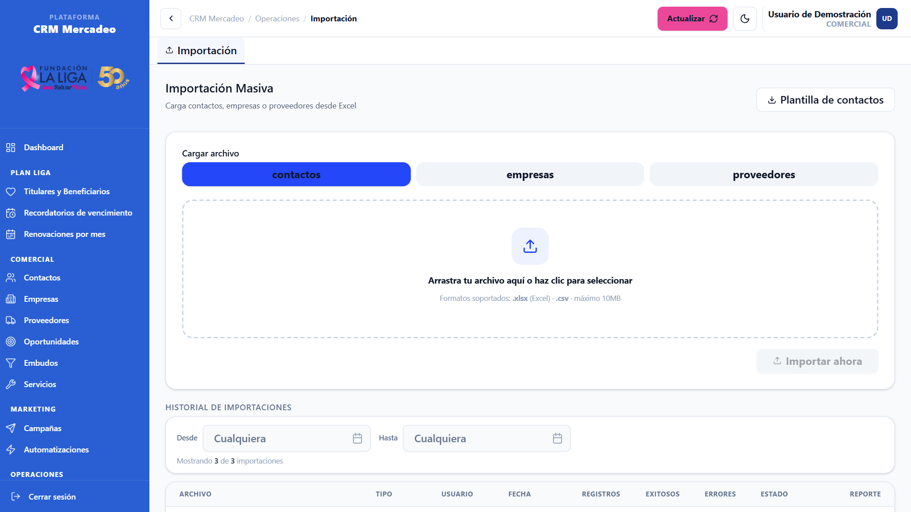

*Nota.* Captura del CRM Mercadeo con datos ficticios de demostración.

**Descargue el reporte de errores enseguida.** El detalle de errores solo está disponible en la misma sesión en la que hizo la importación. Después, el historial muestra «No disponible».

# Cuenta y ayuda

## Configuración

Ruta en el menú: *Menú de usuario › Configuración*.

En **Mi cuenta** verá su nombre, usuario, correo, rol en el portal, rol en el CRM y área.

Los usuarios con permiso de configuración ven además:

- **Buscar nuevo usuario para asignar rol:** busque por nombre, elija un rol en **Nuevo rol** y pulse **Guardar**.
- **Usuarios del CRM:** lista de quienes ya tienen rol. Desde aquí se cambia el rol o se retira con **Eliminar**.

**Figura 19**

*Configuración de cuenta y asignación de roles*

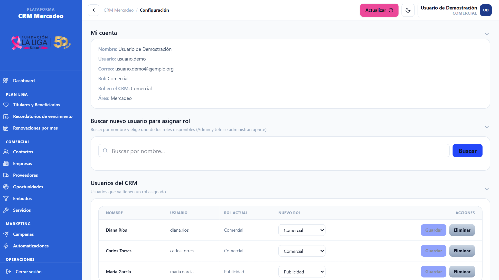

*Nota.* Captura del CRM Mercadeo con datos ficticios de demostración.

**Efecto de cambiar un rol.** La persona afectada verá cerrada su sesión la próxima vez que cambie de pantalla y deberá ingresar de nuevo. Los roles Administrador y Jefe se gestionan con TI.

## Preguntas frecuentes

**No veo un módulo o un botón que aparece en el manual.**
Su rol no tiene ese permiso. Pida al administrador del CRM que revise su rol.

**No puedo agregar más beneficiarios a un titular.**
El titular llegó al cupo de su plan. Puede desactivar un beneficiario, reemplazarlo o, si su rol lo permite, cambiar el plan al renovar.

**El campo «Plan contratado» está bloqueado en Estándar.**
Solo los roles con el permiso «Elegir plan» (normalmente Comercial) pueden asignar otro plan.

**¿Qué diferencia hay entre editar y reemplazar?**
Editar corrige datos de la misma persona. Reemplazar da de baja a una persona y da de alta a otra en su lugar, también en Servinte, y no se puede deshacer.

**Mis plantillas de Campañas desaparecieron.**
Las plantillas se guardan en el navegador. Si cambió de equipo o de navegador, o borró los datos de navegación, no estarán. Importe la copia .html que haya descargado.

**Envié recordatorios y algunos fallaron.**
Revise el detalle de fallos en el resultado o en el Historial de envíos. Suele tratarse de un correo mal escrito. Corríjalo en la ficha del titular; la próxima vez que pulse «Enviar nuevos» se tendrá en cuenta.

**Importé un archivo y no se creó nada.**
En Plan Liga, si el archivo tiene errores de formato no se procesa ninguna fila. En Importación, descargue el Reporte para ver qué filas fallaron y por qué.

**Los datos no se ven actualizados.**
Pulse **Actualizar** en la barra superior para recargar el módulo.

Si su problema no está aquí, comuníquese con el área de TI indicando el módulo, lo que intentaba hacer y el mensaje que apareció.

## Glosario

| Término                        | Significado                                                                                       |
| ------------------------------- | ------------------------------------------------------------------------------------------------- |
| Titular                         | Persona que contrata el Plan Liga. Se registra como tipo de afiliado 1 (cotizante).               |
| Beneficiario                    | Persona incluida en el plan de un titular, dentro de su cupo.                                     |
| Cupo                            | Número máximo de beneficiarios activos que admite el plan de un titular. El Estándar admite 4. |
| Plan contratado                 | Plan del catálogo de Servicios asignado al titular (Estándar u otro).                           |
| Tipo de plan                    | Texto que describe el origen del plan, por ejemplo Liga, Energía o Cámara.                      |
| Fecha de ingreso / inscripción | Fecha desde la que cuenta el año de vigencia del plan.                                           |
| Renovación                     | Titular que ya había estado en Plan Liga y vuelve a activar el plan.                             |
| Alta nueva                      | Titular que se registra en Plan Liga por primera vez.                                             |
| Reemplazo                       | Baja de una persona y alta de otra que hereda su plan, cupo y orden.                              |
| Servinte (ABPAC/INCLE)          | Sistema clínico donde también se registran las altas y bajas de afiliados.                      |
| Prospecto / Cliente             | Tipo de contacto: posible cliente o cliente actual.                                               |
| Oportunidad                     | Posible venta de un servicio a una empresa, contacto o titular, con valor, probabilidad y etapa.  |
| Seguimiento                     | Registro de una interacción. Siempre queda en la Bitácora.                                      |
| Próximo paso                   | Tarea pendiente derivada de una actividad, con fecha límite opcional.                            |
| Segmento                        | Grupo de personas guardado a partir de filtros en Audiencias.                                     |
